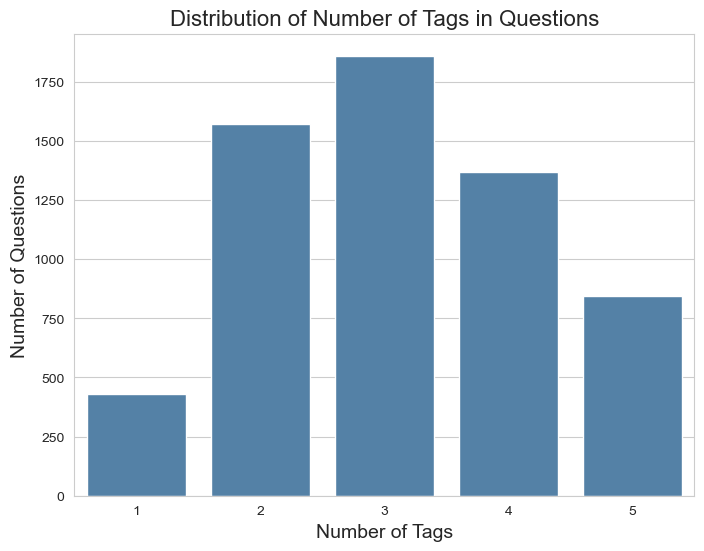
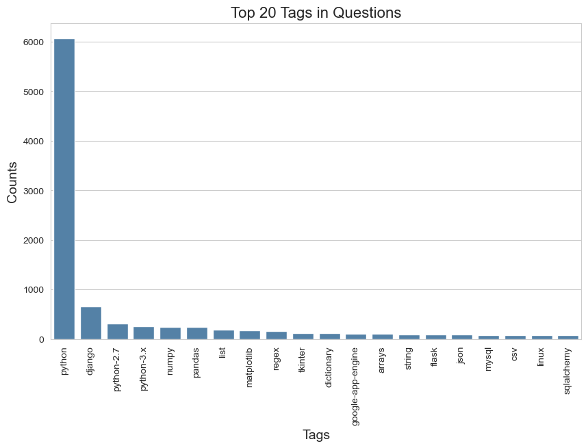

# POC: Multilabel Text Classification For StackOverflow Questions

### This repository is a prototype of an automatic tagger trained with public data from StackOverflow.The goal is to evaluate the feasibility of AI models predicting assigned tags given the text.

***

[Dataset](https://www.dropbox.com/sh/s0v2ai4wkkxktnf/AAAspyrYoNgNSrZOepB7GeQta?dl=0)

**questions.csv** contains ~607k entries:
* Id: question ID  
* OwnerUserId: user ID 
* CreationDate: time when this question was posted 
* Score: number of upvotes minus the number of downvotes 
* Title: question's title 
* Body: question's content 

  

**tags.csv** contains ~1.8m entries:
* Id: question ID 
* Tag: a word or phrase that describes the topic of the question 

***

**
Data Pre-Processing
**

* Remove irrelevant columns
* Remove rows contain Nan values and duplicates
* Merge two tables on the Id 
* Put all tags in a list(Groupby)
* Sampleing subset from the whole dataset(1%, 18846 entries)
* Remove HTML tags, punctuations(keep punctuations in a word,e.g .net and python-2.7) and stopwords, lower cases
* Concatenate Title and Body
* Split train, test dataset

A cleaned, well formated dataset:</b>

***

**
Data Analysis
**

Unique tags: ~4k</b>

Tags appeared once: ~2k</b>

Most of the questions has three tags

* Issues
  * Imbalanced dataset.
  * Many tags appeared only once
* Solution (Future Work):
  * Reduce tags complexity by clustering similar words based on their string similarity/semantic meaning.
  * Data augmentation: create sythetic data for rare tags, large language model like ChatGPT or BERT generate diverse and high quality sythetic data().

***

**
Modeling
**

* Machine Learning Models:
  * SGDClassifier
  * SGDClassifier
  * LinearSVC
</b>
* Deep Learning Models(Future Work):
  * BERT
  * StackOverflowBERT

OneVsRest Classifier: Fit one classifier per class. For each classifier, the class is fitted against all the other classes. It means that problem of multilabel classification is broken down to multiple binary classification problems.

Large language model like BERT will have better performance. Further-pretrain a domain specific StackoverflowBERT and fine-tune with sequence classification task might have even better performance since the pre-train and downstream have less gap. LLM requires less feature engineering.

***

**
Evaluation
**

Metrics  
$$ F1\ Score = 2 \times \frac{(Precision \times Recall)}{(Precision + Recall)} $$

* Micro F1 Score: Calculate F1 globally. This is a better metric when we have a imbalanced dataset. 
* Macro F1 Score: Calculate F1 for each label, and find their unweighted mean. This does not take imbalance into account. 
* Hamming Loss: The Hamming loss is the fraction of labels that are incorrectly predicted. 

|       | MultinomialNB| LR|SVC|BERT| StackOverflowBERT|
| :----:| :----: | :----: |:----: |:----: |:----: |
| F1 Micro| **64.83%** | 62.86%  | 64.34% | / | / |
| F1 Macro| **62.00%** | 53.82%  | 60.94% | / | / |
| Humming | 0.07% | 0.07%  | 0.07%  | / | / |

***

**
Explainability(Future Work)
**

Feature attribution methods like 
[**integrated gradients**](https://arxiv.org/abs/1703.01365), [**SHAP**](https://proceedings.neurips.cc/paper/2017/hash/8a20a8621978632d76c43dfd28b67767-Abstract.html) and **attentions score**(transformer-based LM) can be used to explain the model's prediction. Explainability tools not only build trust in our model, but also help us to generate useful labels for continuous training.

***

**
Future Development of This Prototype
**

* Production Enviroment: 
  * On-premise
  * Cloud

* Data Engineering: data engineer team build, schedule, and monitor scale data pipelines that can handle text data extrated from web. (e.g. Apache Airflow, Apache Spark)

* Performance Optimization: 
  * Optimize the model's inference time to ensure quick and efficient predictions. 
  * Hyperparameter tuning
  * Version control should be implemented to keep track of the different model versions, enable rollbacks in case of any issues.  
  * Offline model update will be performed after certain amount of human feedback is collected. A/B test is needed for re-trained model.

* Monitoring and Logging:
   * Set up monitoring and logging tools to keep track of the model's performance and detect issues before they become critical. 
   * Decide interval to re-train the model. (e.g. Neptune, Wandb)

* Human in the loop(HITL): 
  * Build graphical user interface(GUI) to collect feedback from end users. 
  * Feedback can be binary(like/dislike) or scale(5 points scale rating). 

In summary, CI(testing and validating data and models), CD(training a pipeline and automatically deploy a model prediction service), and CT(automatic model retraining whenever the set model threshold is breached) of MLOps.# StackOverflow
