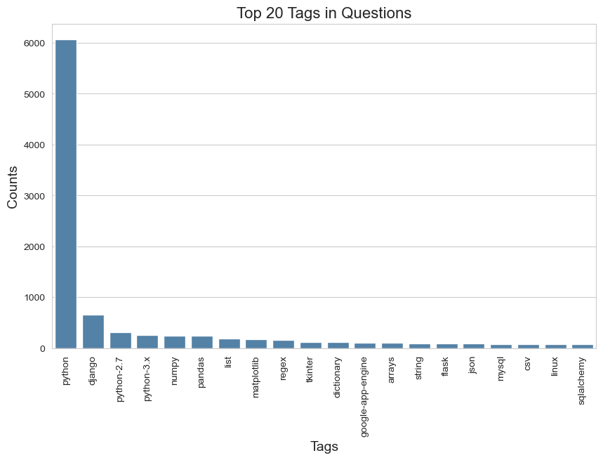

# POC: Multilabel Text Classification For StackOverflow Questions

***

## Metadata

**questions.csv** contains ~607k entries:

  
 

 

**tags.csv** contains ~1.8m entries:

***

## Data Pre-Processing

* Remove irrelevant columns, rows with Nan and duplicates
* Merge two tables on the Id 
* Put all tags in a list(GroupBy)
* Sampleing subset from the whole dataset(1%)
* Remove HTML tags, punctuations and stopwords
* Lower cases
* Concatenate Title and Body

***

## Data Analysis

~6k questions
~4k unique tags
~2k tags appeared only once

***

## Data Analysis

* Issues
  * Imbalanced dataset
  * Many tags appeared only once
* Solutions (Future Work)
  * Reduce tags complexity 
  * Data augmentation

***

## Modeling

* Machine Learning Models:
  * SGDClassifier
  * LogisticRegression
  * LinearSVC
</b>
* Deep Learning Models(Future Work):
  * BERT
  * StackOverflowBERT

***

## Evaluation Metrics

* Micro F1 Score: Calculate F1 globally. 
* Macro F1 Score: Calculate F1 for each label, and find their unweighted mean. 
* Hamming Loss: The Hamming loss is the fraction of labels that are incorrectly predicted. 

***

## Model Performance

|       | SGD| LR|SVC|BERT| StackOverflowBERT|
| :----:| :----: | :----: |:----: |:----: |:----: |
| F1 Micro| **64.83%** | 62.86%  | 64.34% | / | / |
| F1 Macro| **62.00%** | 53.82%  | 60.94% | / | / |
| Humming | 0.07% | 0.07%  | 0.07%  | / | / |

***

## Explainability(Future Work)

Feature attribution methods like [**integrated gradients**](https://arxiv.org/abs/1703.01365), [**SHAP**](https://proceedings.neurips.cc/paper/2017/hash/8a20a8621978632d76c43dfd28b67767-Abstract.html) and **attentions score**(transformer-based LM) can be used to explain the model's prediction. 

Explainability tools not only build trust in our model, but also help us to generate useful labels for continuous training.

***

## Development(Future Work)

* Production Enviroment
* Data Engineering
* Performance Optimization
* Monitoring and Logging
* Human in the Loop(HITL)

In summary, CI(testing and validating data and models), CD(training a pipeline and automatically deploy a model prediction service), and CT(automatic model retraining whenever the set model threshold is breached) of MLOps.